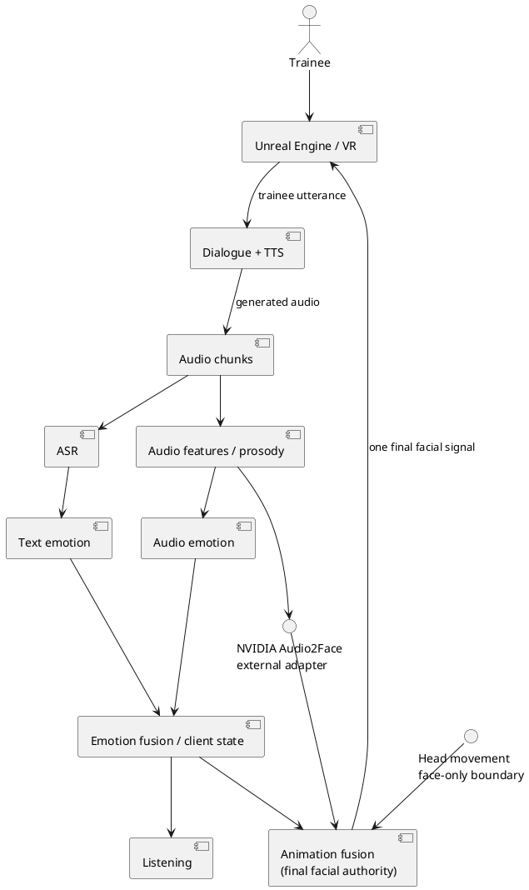

# Resonance

Resonance is a face-only architecture reference for an Unreal Engine VR
client. The Python package in `src/resonance_pipeline` is a deterministic,
dependency-light contract and simulation harness; it is not an Unreal plugin,
an NVIDIA client, or an Audio2Face validation.

## Architecture



The implementation uses immutable dataclasses and small `Protocol` contracts.
`ResonanceOrchestrator` is the explicit application layer: it advances separate
client and trainee audio sources, carries conversation history in client state,
and invokes the stage contracts in order for each deterministic frame.
The paired-source harness assumes client and trainee non-EOS chunks have equal
timestamps; it rejects misalignment rather than buffering or resampling. An
EOS client stream may still be paired with later trainee chunks, which advance
the client state's timestamp.
`FileAudioSource` reads uncompressed 16-bit PCM WAV files in fixed-size chunks,
with sample-rate/channel/format validation, deterministic timestamps, an
explicit end-of-stream marker, and repeatable reads after EOS. `RmsFeatures`,
the local ASR, and local emotion providers are intentionally replaceable demo
implementations. Emotion fusion uses a clamped weighted average of text and
audio emotion; `AnimationFusion` is the sole final facial-output authority.

## Run

Requires Python standard library and `pytest` only:

```sh
PYTHONPATH=src:. python demo.py
PYTHONPATH=src:. pytest -q tests
```

The demo creates a temporary WAV and prints deterministic state and facial
signal values. The Audio2Face and head-movement objects are placeholders at the
boundary only. No NVIDIA network calls, Unreal files, ML models, body motion,
gaze system, or provider registry are included.

## Status

### Implemented

- Python architecture contracts for audio, features, ASR, emotion, listening,
  Audio2Face, head movement, and final animation fusion.
- Deterministic WAV chunk simulation and local demo providers.
- Focused tests for sequencing, partial chunks, EOS, validation, clamping,
  sampling, deterministic fusion, and final-output authority.

Unreal Engine integration, VR rendering, a real NVIDIA Audio2Face adapter,
production providers, and human evaluation are not implemented here. The local
Audio2Face object represents the external adapter boundary with deterministic
placeholder output only; no real-time or perceptual validity is claimed.

## Migration checkpoint

The previous first-party implementation was checkpointed before this reset.
Its old modeling/training path is intentionally not retained in this project;
third-party directories remain unchanged and are not part of this reference.

## Scope

Only the virtual client's face is in scope: facial controls, mouth articulation,
emotion trajectories, minimal head movement where needed for facial output, and
interfaces that feed those signals. Body animation, hands, posture, locomotion,
gaze/social attention, multiple avatars, trainee-emotion diagnosis, automated
therapy, and clinical-effectiveness claims are out of scope.
