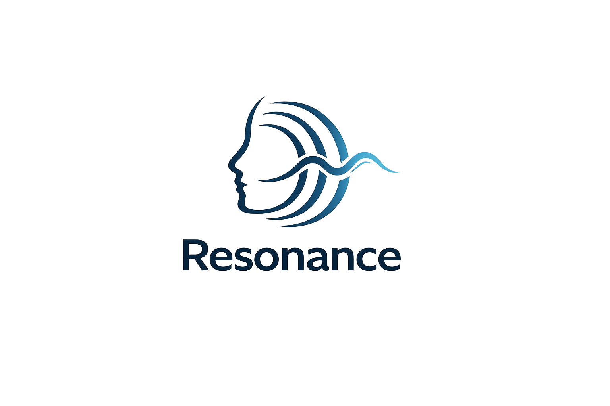

<p align="center">
  
</p>

<h1 align="center">Resonance</h1>

<p align="center">
  A face-focused VR prototype for visualizing the emotional state of a virtual client during counseling training.
</p>

<p align="center">
  <strong>Unity · VR · Facial Animation · VoiCE</strong>
</p>

---

## Overview

**Resonance** explores how the emotional state of an AI-driven virtual client can be represented through facial behavior in VR.

The project is developed as an extension of [VoiCE](https://www.e-beratungsinstitut.de/projekte/voice/), a voice-based AI role-play partner for training psychosocial telephone and online counseling.

The scope is intentionally limited to the **face**. The goal is not to build a complete virtual-human platform, but to investigate whether coherent facial expression can add useful visual information to an existing voice-based training conversation.

## Project Goals

* Display controllable facial expressions and expression intensity.
* Produce smooth transitions between emotional states.
* Synchronize mouth movement with generated speech.
* Combine speech articulation and emotional expression without visible conflicts.
* Run the resulting facial animation in VR with sufficiently low latency.
* Support repeatable training scenarios and later evaluation.

## Scope

### Included

* Facial expressions and blendshape control
* Emotion intensity and temporal smoothing
* Speech-synchronized mouth animation
* Limited blinking and eye behavior where required for naturalness
* Integration with dialogue state, text-to-speech, or prosodic information
* VR rendering and experiment logging

### Not Included

* Full-body animation or tracking
* Hand gestures, posture, or locomotion
* Complex interactive environments
* Automatic diagnosis of trainee emotions
* Automated therapy or clinical-effectiveness claims

## Intended System Structure

The project is designed around separate modules so that facial behavior can be developed and evaluated independently from the dialogue system.

```text
Dialogue / Role-Play Engine
            │
            ├── Emotional state and trajectory
            └── Text-to-speech output
                     │
          ┌──────────┴──────────┐
          │                     │
   Speech articulation    Emotional expression
   phonemes / visemes     blendshapes / controls
          │                     │
          └──────────┬──────────┘
                     │
             Fusion and smoothing
                     │
              Avatar face rig
                     │
                Unity VR runtime
```

This represents the intended architecture and may change as the prototype develops.

## Evaluation Targets

Future evaluation may cover three levels:

* **Technical:** frame rate, latency, jitter, lip synchronization, and temporal stability
* **Perceptual:** emotion recognition, congruence, naturalness, and uncanny response

## Acknowledgements

Resonance builds on the concept and research context of the [VoiCE project](https://www.e-beratungsinstitut.de/projekte/voice/).
