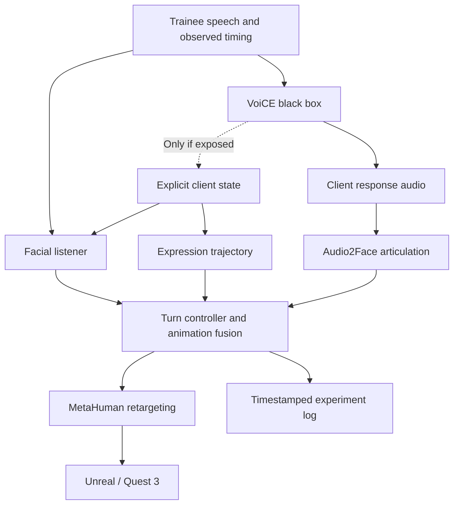

# Resonance — VoiCE in VR

A face-focused VR extension of **VoiCE** for psychosocial counseling education. Resonance investigates how one virtual client can remain coherent and responsive while **listening, waiting for a response and speaking**.

**Status — 7 October 2026:** a deterministic Python contract/simulation harness and an Unreal Engine 5.6 editor project with VR template and MetaHuman assets exist. Real NVIDIA Audio2Face integration, headset execution and human evaluation remain planned and unvalidated. See [Unreal collaboration setup](unreal/README.md).

[Initial issues](https://github.com/Sommer-Lukas/Resonance/issues) · [Milestones](https://github.com/Sommer-Lukas/Resonance/milestones) · [Roadmap](docs/roadmap.md) · [Architecture](docs/architecture.md) · [Research](docs/research.md) · [Evaluation](docs/evaluation.md)

## 1. Project idea and objectives

[VoiCE — Voice-based client for Counselor Education](https://www.e-beratungsinstitut.de/projekte/voice/) is a voice-based AI role-play project for psychosocial telephone and online counseling education. Resonance adds a visible virtual client for a VR training prototype; it does not recreate VoiCE or claim clinical effectiveness.

The target is one complete conversation loop: the trainee speaks, the client shows restrained listening behavior, remains coherent during the response delay, speaks with synchronized mouth motion and returns smoothly to listening.

**Boundary:** facial expression, articulation, blinking and limited eye behavior only if needed to avoid an artificial face. Minimal head motion is restricted to the face experiment. Bodies, hands, posture, locomotion, complex gaze/social attention, environments, multiple avatars and trainee-emotion diagnosis are outside scope.

VoiCE is treated as a black box. Available inputs, outputs and events must be verified in [#3](https://github.com/Sommer-Lukas/Resonance/issues/3); no transcript, emotion state or API is assumed.

## 2. Planned functionality

| Level | Deliverable |
|---|---|
| MVP | One controllable MetaHuman face in Unreal; verified Audio2Face or documented articulation fallback; Quest 3 display; blinking/minimal idle; smooth listening ↔ speaking switch. |
| Research core | Sparse timing-aware facial listener; observable turn/waiting controller; end-to-end VoiCE adapter; deterministic replay and logging; baseline comparison. |
| Stretch | Prosody or transcript conditioning if accessible; response-aware pre-speech behavior; explicit continuous emotion control and richer trajectories. |

Prefer a controlled or authored client state when available. Emotion inference from generated audio is optional research, not a prerequisite. Articulation and expression must remain separable and be combined by one final animation authority.

## 3. Research questions — working draft

**Main:** How can a virtual client maintain continuous, responsive facial behavior across listening, waiting and speaking?

- **RQ1:** Does timing-aware facial listening improve perceived responsiveness and reaction appropriateness compared with idle behavior?
- **RQ2:** At matched technical response delay, does turn-aware waiting behavior change perceived waiting time and conversational coherence?
- **Technical subquestion:** Does a blended transition reduce visible discontinuities relative to a hard switch?

These are proposed questions and hypotheses, not established results. Finalize one primary outcome and a feasible comparison in [#2](https://github.com/Sommer-Lukas/Resonance/issues/2). Connecting technologies alone is integration; a research contribution needs an explicit behavior method and comparative evidence.

## 4. Target architecture


```mermaid
flowchart TD
    Input["Trainee speech and observed timing"] --> Voice["VoiCE black box"]
    Input --> Listener["Facial listener"]
    Voice --> Audio["Client response audio"]
    Voice -. "Only if exposed" .-> State["Explicit client state"]
    State --> Listener
    State --> Expression["Expression trajectory"]
    Audio --> Articulation["Audio2Face articulation"]
    Listener --> Fusion["Turn controller and animation fusion"]
    Expression --> Fusion
    Articulation --> Fusion
    Fusion --> Rig["MetaHuman retargeting"]
    Rig --> VR["Unreal / Quest 3"]
    Fusion --> Log["Timestamped experiment log"]
```

TTS remains inside VoiCE if VoiCE already delivers speech. A separate TTS component is needed only if the verified interface delivers text. Waiting means the observed interval between input completion and output start; it does not assert an internal backend state.

The existing Python harness has replaceable contracts for audio, features, ASR, emotion, listening, Audio2Face and fusion. Its local providers are placeholders. Its equal-timestamp paired-stream assumptions are for offline simulation, not a production live scheduler. See [implementation reference](docs/implementation-reference.md).

## 5. Approach and method

1. Verify VoiCE access and engine/plugin/GPU compatibility during project definition.
2. Establish direct MetaHuman facial control and a reproducible fixed-audio speaking demo.
3. Test Quest 3 execution and performance early, initially targeting PCVR; standalone operation is unverified.
4. Build a minimal idle/listening baseline, observed conversation events and smooth animation switching.
5. Add a sparse timing-aware listener with bounded intensity, cooldowns and replayable scheduling.
6. Connect the verified VoiCE input/output adapter; handle waiting, errors and cancellation where supported.
7. Pilot and compare baseline/reactive/transition conditions; freeze features before evaluation.

Use small issues, issue branches, pull requests and review. Board workflow: **Backlog → Ready → In Progress → Review/Testing → Done**. A GitHub Project board is optional and not yet configured. Priorities: P0 blocker, P1 required, P2 optional improvement, P3 stretch. Later tasks stay in milestone checklists until ready for detailed issues.

## 6. Technical foundations and resources

| Area | Planned resource / current status |
|---|---|
| Rendering and facial rig | Unreal Engine + MetaHuman; versions and licenses to verify. |
| Speech articulation | NVIDIA Audio2Face route; exact component, plugin, GPU and runtime requirements to verify. |
| Headset | Meta Quest 3; initial PCVR target, performance evidence pending. |
| Dialogue | Existing VoiCE; interface/access inventory pending. |
| Reference harness | Python standard library + pytest; implemented local simulation. |
| Analysis | Python; metric and statistical choices to finalize before recruitment. |
| Collaboration | GitHub issues, milestones and pull requests; named ownership pending. |

Do not infer hardware suitability from placeholder output. Vendor assets/models have separate licenses; the repository's MIT license does not cover them.

## 7. Schedule and milestones

Dates are in the 2026/27 winter semester. Internal deadlines are planning targets, not instructor-confirmed submissions.

| Milestone | Target | Definition of done |
|---|---|---|
| M0 — Project Definition | 27 Oct 2026 | Scope, RQs, interface inventory, architecture, ownership, risks and proposal ready. |
| M1 — Talking MetaHuman | 10 Nov 2026 | Fixed test audio produces reproducible facial articulation through the verified adapter. |
| M2 — VR Prototype | 17 Nov 2026 | Talking face runs in Quest 3/PCVR with recorded frame-time evidence. |
| M3 — Conversation Baseline | 24 Nov 2026 | Idle/listening/speaking switching demo for the assessed progress presentation. |
| M4 — Reactive Listener | 8 Dec 2026 | Timing-aware facial listener, transition demo and poster ready. |
| M5 — VoiCE Integration | 22 Dec 2026 | Complete input → listening/waiting → response → speaking loop; feature freeze. |
| M6 — Evaluation Complete | 12 Jan 2027 | Pilot, technical/perceptual evaluation and analysis dataset complete. |
| M7 — Final Project | 19 Jan 2027 | Final demo, report, WordPress contribution and presentation ready for the earliest final slot. |

**Course-date uncertainty:** the assessment slide explicitly names **8 December** for the poster; the timetable's visual alignment suggests **15 December**. Plan for the earlier date until clarified. Final presentation slots are **19 and 26 January**; the group's slot remains unconfirmed.

On **27 October**, also show the application implemented in the exercises. This is separate from the VR project proposal and must not disappear from preparation.

## 8. Ownership

| Responsibility | Primary owner |
|---|---|
| Unreal / MetaHuman / Quest / articulation adapter | To agree with the team |
| Facial listener / temporal behavior | To agree with the team |
| VoiCE adapter / conversation events / logging | To agree with the team |
| Research, evaluation, documentation and review | Shared; each active issue still needs one owner |

No team members or assignees have been guessed. Assign ownership in [#9](https://github.com/Sommer-Lukas/Resonance/issues/9).

## 9. Open questions and risks

| Risk | Trigger / uncertainty | Mitigation and fallback |
|---|---|---|
| VoiCE signals or continued access unavailable | Interface and access after October unknown | Investigate in M0; fixed-audio/mocked adapter supports controlled face experiments but is not live integration. |
| A2F–MetaHuman incompatibility | No real adapter validation | Compatibility spike in M0, demo by M1; conventional lip sync/prerecorded articulation fallback. |
| Quest frame budget exceeded | No headset measurements | Early PCVR profiling, lower asset/render cost; do not promise standalone performance. |
| Facial reactions seem artificial or imply agreement | Timing/intensity/context ambiguous | Small reaction set, sparse scheduling, pilot judgments; a client can remain neutral, distressed or hesitant. |
| Scope or recruitment overruns | Too many models or late study planning | Timing-only baseline first; pilot/recruitment planned in M0, feature freeze 22 December. |
| Course dates conflict | Poster and final slot uncertain | Plan to earlier dates; confirm with course staff through team workflow. |

Risk ownership and evaluation preparation are tracked in [#10](https://github.com/Sommer-Lukas/Resonance/issues/10).

## Existing Python reference — run

```sh
python -m pip install -r requirements.txt
PYTHONPATH=src:. python demo.py
PYTHONPATH=src:. pytest -q tests
```

The demo uses a temporary WAV and deterministic placeholder providers. It does not connect to NVIDIA or Unreal. Runtime, lip-sync, naturalness and training-value claims require future device/human evidence.

## Presentation source map and references

| Requirement from the 27 October slide | Source of truth |
|---|---|
| Project idea and objectives | README §1 |
| Planned functionality | README §2 |
| Approach and methodology | README §5 + issues |
| Technical foundations and resources | README §6 + architecture inventory |
| Schedule and milestones | README §7 + roadmap + GitHub milestones |
| Open questions and risks | README §9 + issue #10 |

- **VoiCE project context:** Institut für E-Beratung, [VoiCE project page](https://www.e-beratungsinstitut.de/projekte/voice/), introductory project description, accessed 6 October 2026. It describes the educational role-play purpose, not a documented integration API.
- **Course requirements:** uploaded **17772.jpg**, slide 9, “Was ist am 27.10 vorzustellen?”; **17770.jpg**, slide “Prüfungsleistungen”; **17768.jpg**, slide 7, “Zeitplan”. Dates above reflect the conflict rather than silently resolving it.
