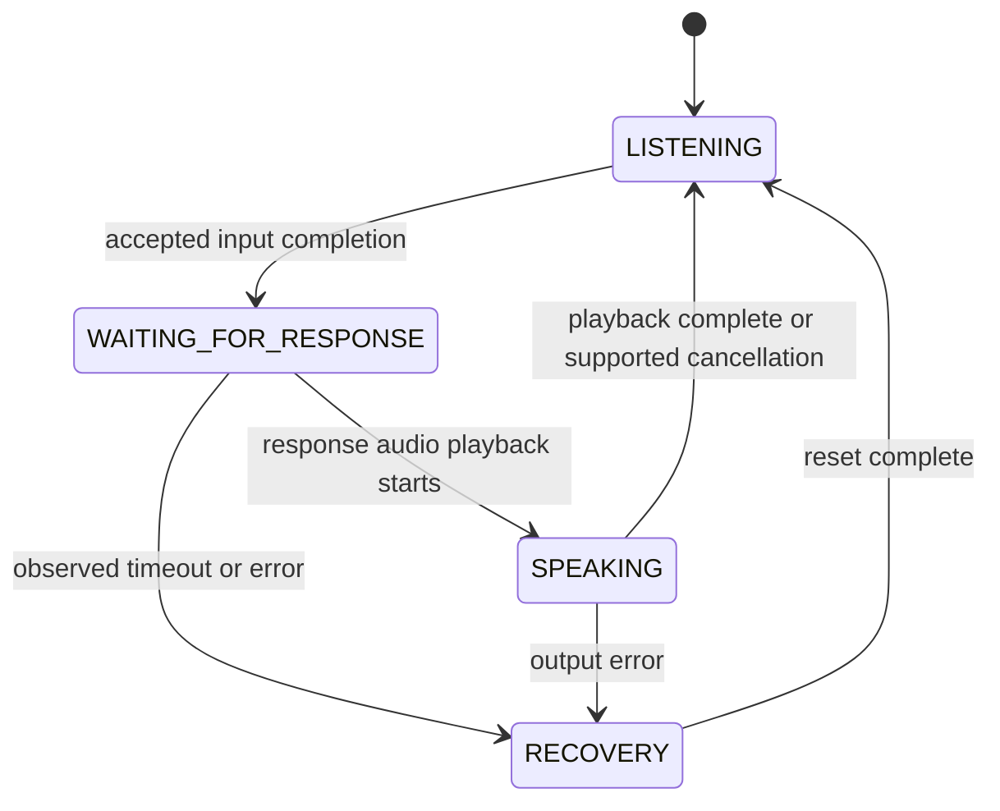

# Architecture and interface inventory

Status: proposal. No real VoiCE API, NVIDIA adapter or Unreal integration has been validated. Track discovery in [#3](https://github.com/Sommer-Lukas/Resonance/issues/3) and architecture in [#4](https://github.com/Sommer-Lukas/Resonance/issues/4).

## Interface inventory

| Signal | Available? | Format / timestamp | When available? | Evidence |
|---|---|---|---|---|
| Trainee audio | Unknown | Unknown | Unknown | Pending |
| VAD / turn-end events | Unknown | Unknown | Unknown | Pending |
| Transcript | Unknown | Unknown | Unknown | Pending |
| Client response text | Unknown | Unknown | Unknown | Pending |
| Client response audio | Unknown | Unknown | Unknown | Pending |
| Explicit client emotion/state | Unknown | Unknown | Unknown | Pending |
| Cancellation / error / EOS | Unknown | Unknown | Unknown | Pending |

The public [VoiCE project description](https://www.e-beratungsinstitut.de/projekte/voice/), introductory section, establishes purpose only. It does not confirm these signals.

## Modules and boundaries

| Module | Input → output | Design constraint |
|---|---|---|
| VoiCE adapter | Verified events/audio → normalized turn stream | Black box; no assumed internal state. |
| Client state/trajectory | Authored or available explicit state → timed facial expression | Start controllable; audio/text inference optional. |
| Listener | Trainee speech timing → sparse facial reaction events | Timing-only baseline; optional transcript/prosody later. |
| Articulation | Actual client speech audio → mouth/facial articulation | Real A2F adapter replaces placeholder after validation. |
| Fusion/controller | Phase + articulation + expression → final facial values | Single authority, explicit conflict rules and smoothing. |
| Retargeting/runtime | Final controls → rig curves and VR frames | Versioned mapping; profile actual device. |
| Instrumentation | Turn/reaction/audio/frame events → minimized timestamp log | Replayable conditions; avoid sensitive raw data by default. |

## Observable phases

Input completion must come from a verified turn signal or a documented local policy. A pause alone does not prove the turn ended. Interruption support is an open contract, not assumed VoiCE functionality.

## Fusion decisions to validate

- Specify each provider's allowed channels. Preserve speech articulation when expressive mouth controls conflict.
- Crossfade listener/expression outputs at phase transitions; reset stale curves and smooth bounded intensity.
- Keep blinking consistent across phases and avoid concurrent writers.
- Do not silently adopt A2F emotion behavior as the intended client emotion.
- Log every event on one monotonic timeline with turn IDs, condition and deterministic scheduling seed.

The existing harness requires aligned non-EOS timestamps and does not buffer live streams. Preserve its deterministic contract; implement live timing in a separately documented adapter.

## Compatibility record — pending

Record OS, GPU/VRAM, Unreal version, MetaHuman asset/rig version, exact NVIDIA component/plugin, Quest runtime/link mode, audio format and licenses. Link evidence and successful fixed-audio/device measurements. No version has been selected by this planning change.
